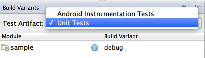
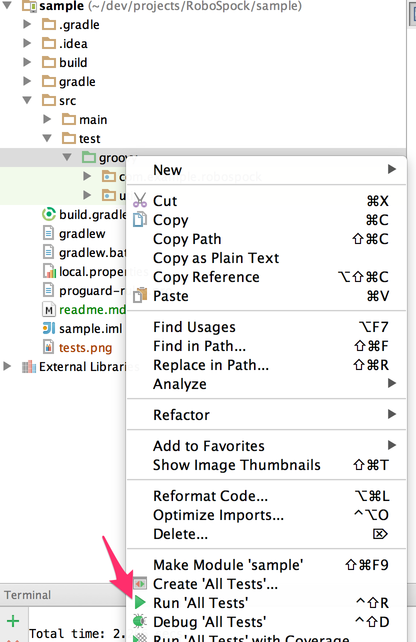

The sample project
==================

Building
--------
Build the sample project as any other Android application using gradle wrapper

  ```shell
  $ ./gradlew clean assemble
  ```

Testing from command line
-------------------------
In order to run all unit test just run the **test** task

  ```shell
  $ ./gradlew test
  ```

By default tests from both Debug and Release flavour are run. If you'd like to test only the Debug build use child task

  ```shell
  $ ./gradlew testDebug
  ```

HTML report is usually generated at this path ```./build/reports/tests/debug/index.html```


Testing from Android Studio
----------------------
Our IDE supports running unit tests only when **Test Artifact** is set to "Unit Tests".



When set just use context menu over **groovy** directory and choose "Run all tests"




Tested under versions:
* Gradle 2.2
* Android Gradle Plugin 1.2.3
* Android Studio 1.3 Beta